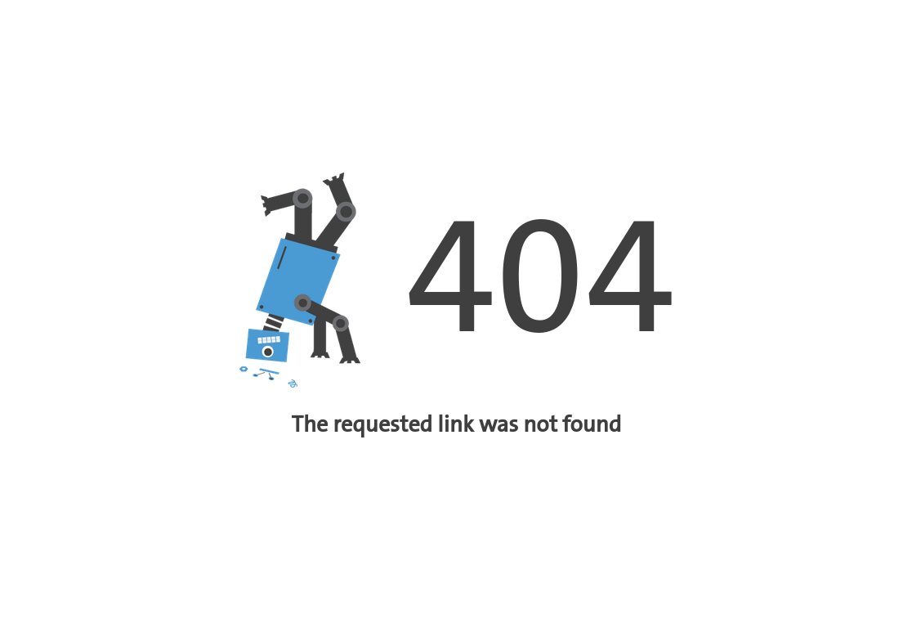
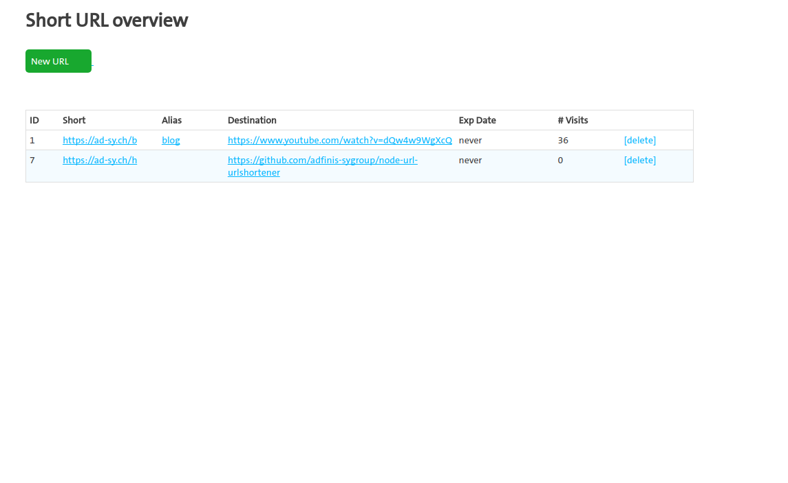
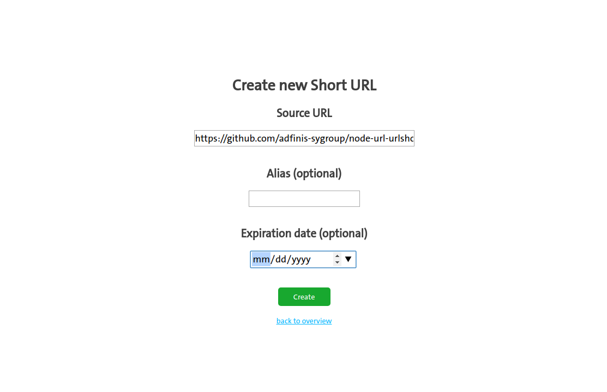

# URLShortener

Simple node app for an URL shortener service.
It creates URLs like https://ad-sy.ch/b

## Screenshots

<a href="./doc/screenshot-404.png"></a>
<a href="./doc/screenshot-admin.png"></a>
<a href="./doc/screenshot-newurl.png"></a>

## Installation

```
# adduser urlshortener
# git clone git@github.com/adfinis-sygroup/node-url-urlshortener /var/www/urlshortener
# chown urlshortener:urlshortener /var/www/urlshortener/
# cd /var/www/urlshortener
# mysql urlshortener < db/create.sql
# vim db.js # <- adjust username and password
# su - urlshortener
$ cd /var/www/urlshortener
$ npm install
$ pm2 start --name=urlshortener npm -- start
```

## Usage

Pretty self-explanatory, go to yoururl.tld/admin for creating a new URL.
